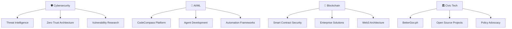

# 🛡️ **ALVIN T. VEROY**

## **THE TECH GUARDIAN WHO SPEAKS HUMAN** | 🇵🇭 Digital Protector | 🚀 Innovation Navigator

---

### 🔥 **HERO BRAND MANIFESTO** 🔥

*"Over 25 years of protecting systems taught me where the real threats hide. I'm here to serve, to share what I've learned, and to help make you stronger."*

---

## 🎯 **WHO I AM**

> **Technology Consultant | Cybersecurity Pioneer | Blockchain Expert | Civic Tech Champion**

🔹 **25+ Years** in technology and cybersecurity, learning from both sides of the digital landscape  
🔹 **Recognized** by Time Magazine & CNN for security research and responsible disclosure  
🔹 **Executive Technology Advisor** for DICT's Scam Watch PH  
🔹 **Former explorer** of the dark side of the internet—lessons learned now applied to protection  
🔹 **Builder** of CodeCompass, BetterGov.ph, and enterprise infrastructure  
🔹 **Advocate** for millions through vulnerability disclosure and threat analysis  

---

## 🚀 **THE FIVE PILLARS OF MY MISSION**

### 🛡️ **1. DIGITAL PROTECTOR** `#CyberSecurity #ThreatHunting`

- **Real-time threat analysis** serving Filipino businesses
- **Vulnerability disclosure** helping protect platforms like GCash, Viber, and enterprise systems
- **Zero-trust architecture** guidance for ASEAN markets
- **Incident response** frameworks designed for practical, local budgets

### ⚡ **2. INNOVATION NAVIGATOR** `#AI #Blockchain #DevSecOps`

- **AI Agent Development** with CodeCompass automation platform
- **Blockchain Implementation** from enterprise systems to startup MVPs
- **Infrastructure as Code** for secure, scalable deployments
- **Technology guidance** helping future-proof the Philippine tech ecosystem

### 💭 **3. VULNERABLE MENTOR** `#AuthenticLeadership #RealTalk`

- **Sharing lessons** from both successes and failures (including costly startup lessons)
- **Honest journey** navigating challenges in tech leadership
- **Human-first approach** to technical complexity
- **Mentoring** the next generation of Filipino tech leaders

### 🏛️ **4. CIVIC TECH CHAMPION** `#OpenSource #GovTech #Transparency`

- **BetterGov.ph** core contributor working toward digital transparency
- **Open-source** solutions addressing government inefficiency
- **Policy advocacy** for ethical AI and blockchain regulation
- **Digital rights** protection in the Philippine context

### 🎮 **5. PLAYFUL DISRUPTOR** `#TechHumor #Contrarian #MobileLegends`

- **Thoughtful perspectives** challenging tech industry assumptions
- **Gaming insights** applied to distributed systems thinking
- **Clear communication** making complex topics accessible
- **Memorable approaches** to serious security topics

---

## 📊 **CURRENT FOCUS AREAS**

---

## 🏆 **SIGNATURE ACHIEVEMENTS**

### 🎖️ **SECURITY IMPACT**
- **Responsible Disclosure**: Identified and reported vulnerabilities protecting millions of users
- **Enterprise Security**: Designed zero-trust architectures for ASEAN organizations
- **Threat Intelligence**: Real-time analysis framework protecting Filipino businesses
- **Advisory Role**: Executive Technology Advisor for DICT Scam Watch PH

### 💡 **INNOVATION LEADERSHIP**
- **CodeCompass**: AI agent automation platform for Filipino developers
- **Blockchain Architecture**: Enterprise implementations from Accenture to startups
- **DevSecOps**: Security-first infrastructure patterns for scaling organizations
- **Tech Evangelism**: Speaking engagements on cybersecurity and emerging tech

### 🌍 **COMMUNITY CONTRIBUTION**
- **BetterGov.ph**: Core contributor to digital transparency initiatives
- **Open Source**: Building accessible tools for government and civic tech
- **Mentorship**: Guiding next-generation Filipino tech leaders
- **Knowledge Sharing**: Regular insights on technology, security, and innovation

---

## 💼 **TECHNICAL EXPERTISE**

### 🛡️ **CYBERSECURITY**
`Penetration Testing` `Threat Intelligence` `Incident Response` `Zero Trust` `Security Architecture` `Vulnerability Assessment` `SIEM` `SOC Operations`

### 🤖 **AI & AUTOMATION**
`LLM Integration` `AI Agents` `Workflow Automation` `Machine Learning` `Natural Language Processing` `RAG Systems` `Prompt Engineering`

### 🔗 **BLOCKCHAIN & WEB3**
`Smart Contracts` `Solidity` `Web3.js` `DeFi` `NFTs` `Blockchain Architecture` `Token Economics` `Security Auditing`

### ☁️ **INFRASTRUCTURE & DEVOPS**
`AWS` `Azure` `GCP` `Docker` `Kubernetes` `Terraform` `CI/CD` `Infrastructure as Code` `GitOps` `Monitoring`

### 💻 **DEVELOPMENT**
`Python` `JavaScript/TypeScript` `Node.js` `React` `API Design` `Microservices` `Database Design` `System Architecture`

---

## 🌟 **FEATURED PROJECTS**

### 🤖 **CodeCompass** - AI Agent Automation Platform

*"Making AI agents accessible to Filipino developers"*

- **Smart Automation**: Workflow orchestration with LLM integration
- **Developer-First**: Simple APIs, extensive documentation
- **Enterprise-Ready**: Security, compliance, and scale built-in

### 🏛️ **BetterGov.ph** - Digital Transparency Initiative

*"Technology for accountable governance"*

- **Open Source**: Government systems transparency
- **Community Driven**: Collaborative civic technology
- **Impact Focused**: Real solutions for Filipino citizens

### 🛡️ **Threat Intelligence Framework**

*"Protecting ASEAN businesses from emerging cyber threats"*

- **Real-time Analysis**: Automated threat detection
- **Contextual Intelligence**: Philippines-specific risk assessment
- **Actionable Insights**: From detection to prevention

---

## 💬 **RECENT INSIGHTS**

> *"Everyone's talking about AI replacing developers. I've built 50+ AI agents in the last 6 months. Here's what I've learned: AI doesn't replace developers—it enhances those willing to adapt and learn."*

> *"After 25 years in tech, I've learned that the best solutions often come from understanding both the technical and human sides of problems. It's never just about the code."*

> *"Having seen both the dark side and the protective side of technology, I've learned that the most important work isn't just building systems—it's building trust and empowering others."*

---

## 🎯 **LET'S CONNECT & BUILD**

### 🚀 **How I Can Serve**

**I'm here to help with:**

- 🛡️ **Security Consultation** - Enterprise threat assessment and guidance
- 🤖 **AI Implementation** - Custom agent development and integration
- 🔗 **Blockchain Architecture** - Smart contract security and design
- 🏛️ **Civic Tech Projects** - Open source collaboration
- 🎤 **Speaking Engagements** - Cybersecurity & innovation insights

**Let's build something worth protecting. Together.**

---

*"True strength in technology comes not from what we know, but from our willingness to serve, protect, and continuously learn."*

**⭐ Star this repo if you believe in technology that protects and empowers! ⭐**

---

🔄 Last updated: October 2024 | 🛡️ Always learning | 🚀 Always serving | 💙 Built with Filipino pride

