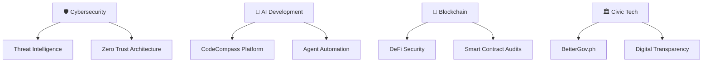

# 🛡️ **ALVIN T. VEROY**
## **THE TECH GUARDIAN WHO SPEAKS HUMAN** | 🇵🇭 Digital Protector | 🚀 Innovation Navigator

---

### 🔥 **HERO BRAND MANIFESTO** 🔥
*"I've been protecting systems since before cybersecurity had a name. 25 years of scars taught me where the real threats hide. I'm not here to sell you fear—I'm here to make you stronger."*

---

## 🎯 **WHO I AM**

> **Technology Consultant | Cybersecurity Pioneer | Blockchain Expert | Civic Tech Champion**

🔹 **25+ Years** protecting systems before cybersecurity was even a profession  
🔹 **Featured** in Time Magazine & CNN for groundbreaking security work  
🔹 **Executive Technology Advisor** for DICT's Scam Watch PH  
🔹 **Co-Founder** of local hacker collective (1998) - from underground to guardian  
🔹 **Builder** of CodeCompass, BetterGov.ph, and enterprise infrastructure  
🔹 **Protector** of millions through vulnerability disclosure and threat analysis  

---

## 🚀 **THE FIVE PILLARS OF MY MISSION**

### 🛡️ **1. DIGITAL PROTECTOR** `#CyberSecurity #ThreatHunting`
- **Real-time threat analysis** protecting Filipino businesses
- **Vulnerability disclosure** that saved millions (GCash, Viber, enterprise systems)
- **Zero-trust architecture** implementation for ASEAN markets
- **Incident response** frameworks for peso budgets, not dollar budgets

### ⚡ **2. INNOVATION NAVIGATOR** `#AI #Blockchain #DevSecOps`
- **AI Agent Development** with CodeCompass automation platform
- **Blockchain Implementation** from Accenture enterprise to startup MVPs
- **Infrastructure as Code** for secure, scalable deployments
- **Future-proofing** Philippine tech ecosystem with emerging technologies

### 💭 **3. VULNERABLE MENTOR** `#AuthenticLeadership #FailFast`
- **Sharing failures** alongside victories (including $50K startup lessons)
- **Transparent journey** from depression to tech leadership
- **Human-first approach** to technical complexity
- **Mentoring** next generation of Filipino tech leaders

### 🏛️ **4. CIVIC TECH CHAMPION** `#OpenSource #GovTech #Transparency`
- **BetterGov.ph** core contributor fighting for digital transparency
- **Open-source** solutions for government inefficiency
- **Policy advocacy** for ethical AI and blockchain regulation
- **Digital rights** protection in the Philippine context

### 🎮 **5. PLAYFUL DISRUPTOR** `#TechHumor #Contrarian #MobileLegends`
- **Hot takes** that challenge tech industry groupthink
- **Gaming insights** applied to distributed systems thinking
- **Sarcastic wisdom** making complex topics accessible
- **Pattern interrupts** that make serious security topics memorable

---

## 📊 **CURRENT FOCUS AREAS**

---

## 🏆 **SIGNATURE ACHIEVEMENTS**

| 🎯 **Impact** | 📈 **Scale** | 🛡️ **Protection** |
|---------------|--------------|-------------------|
| **Time Magazine Feature** (1998) | **Millions Protected** | **Enterprise Security** |
| **CNN Interview Coverage** | **Government Advisory** | **Vulnerability Disclosure** |
| **DICT Scam Watch PH** | **25+ Years Experience** | **Threat Intelligence** |
| **BetterGov.ph Core** | **Multi-Domain Expert** | **Digital Rights** |

---

## 🔥 **MY ORIGIN STORY: FROM HACKER TO GUARDIAN**

### 🕹️ **The Beginning** (1990s)
*Started with a broken Nintendo controller and a neighborhood electronics repair shop...*

### 💻 **The Awakening** (1998)
*Co-founded underground hacker collective, featured in international media*

### 💔 **The Fall** (Dot-com Crash)
*Lost everything, battled depression, worked as dishwasher to afford medication*

### 🚀 **The Rise** (Enterprise Years)
*Accenture leadership, building systems that protect millions*

### 🛡️ **The Guardian** (Today)
*Executive advisor, open-source contributor, mentor, protector*

---

## 🛠️ **TECH STACK & EXPERTISE**

**SECURITY & INFRASTRUCTURE**

**DEVELOPMENT & AUTOMATION**

---

## 📈 **GITHUB STATS & ACTIVITY**

---

## 🌟 **FEATURED PROJECTS**

### 🤖 **CodeCompass** - AI Agent Automation Platform
*"Making AI agents accessible to Filipino developers"*
- **Smart Automation**: Workflow orchestration with LLM integration
- **Developer-First**: Simple APIs, extensive documentation
- **Enterprise-Ready**: Security, compliance, and scale built-in

### 🏛️ **BetterGov.ph** - Digital Transparency Initiative
*"Technology for accountable governance"*
- **Open Source**: Government systems transparency
- **Community Driven**: Collaborative civic technology
- **Impact Focused**: Real solutions for Filipino citizens

### 🛡️ **Threat Intelligence Framework**
*"Protecting ASEAN businesses from emerging cyber threats"*
- **Real-time Analysis**: Automated threat detection
- **Contextual Intelligence**: Philippines-specific risk assessment
- **Actionable Insights**: From detection to prevention

---

## 💬 **RECENT VIRAL INSIGHTS**

> *"Everyone's talking about AI replacing developers. I've built 50+ AI agents in the last 6 months. Here's what actually happens: AI doesn't replace developers—it replaces developers who don't adapt."*

> *"Your blockchain startup doesn't need blockchain. You need a spreadsheet and therapy. Here's how to tell the difference..."*

> *"I was featured in Time Magazine in 1998. 25 years later, I still feel like a fraud sometimes. Here's what nobody tells you about 'making it' in tech."*

---

## 🎯 **LET'S CONNECT & BUILD**

### 🚀 **Ready to protect your digital future?**

**I'm here for:**
- 🛡️ **Security Consultation** - Enterprise threat assessment
- 🤖 **AI Implementation** - Custom agent development
- 🔗 **Blockchain Architecture** - Smart contract security
- 🏛️ **Civic Tech Projects** - Open source collaboration
- 🎤 **Speaking Engagements** - Cybersecurity & innovation

**Let's build something worth protecting. Together.**

---

*"I'm not a hero because I have all the answers. I'm a hero because I'll stand between you and the threats that most people don't even know exist yet."*

**⭐ Star this repo if you believe in technology that protects and empowers! ⭐**

---

🔄 Last updated: October 2024 | 🛡️ Always protecting | 🚀 Never stopping | 💙 Built with Filipino pride
